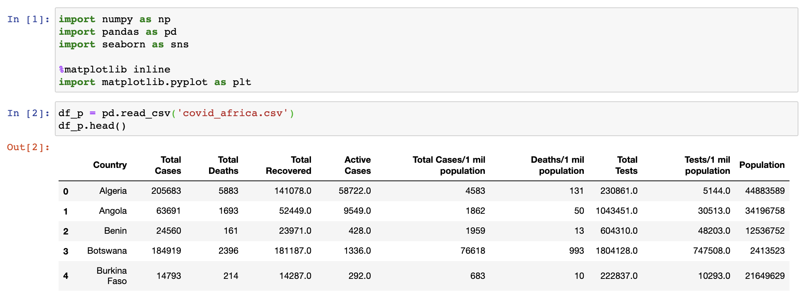
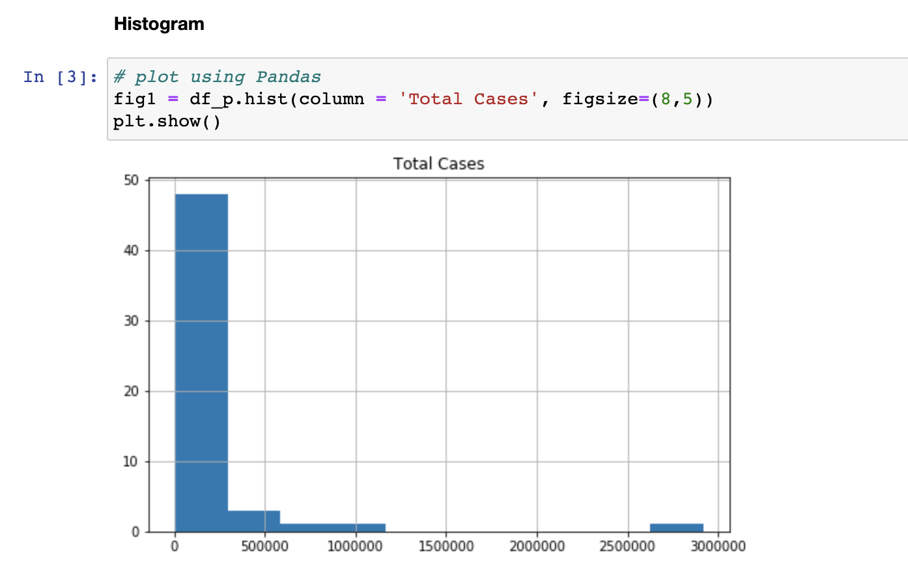
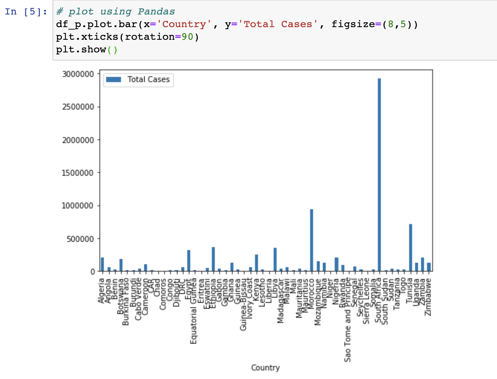
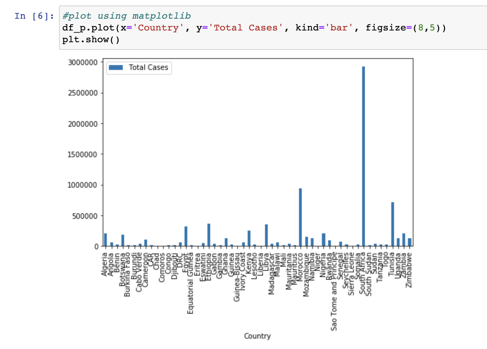
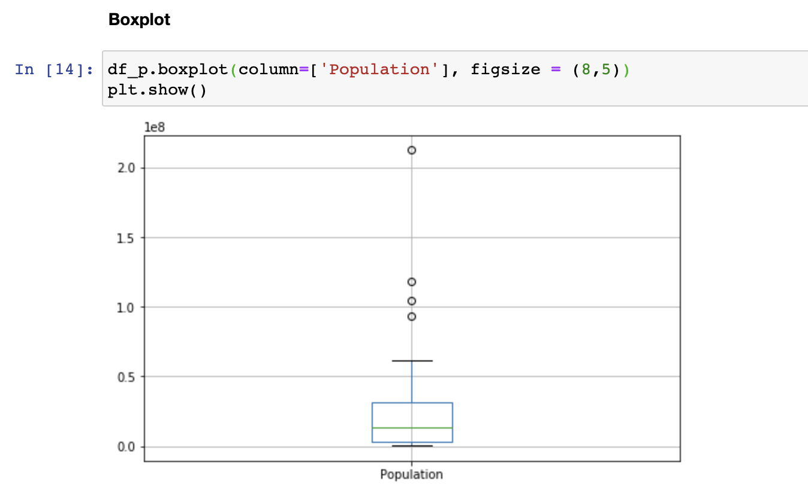
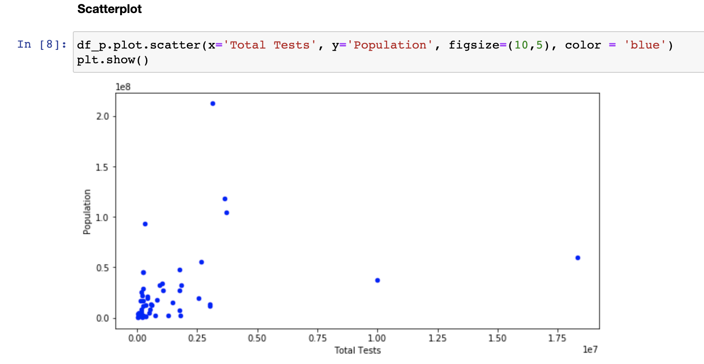
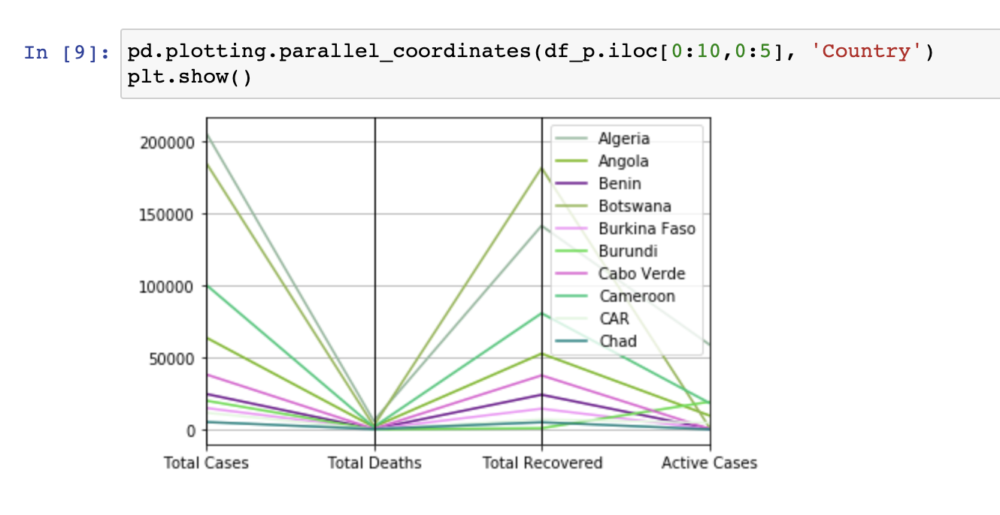
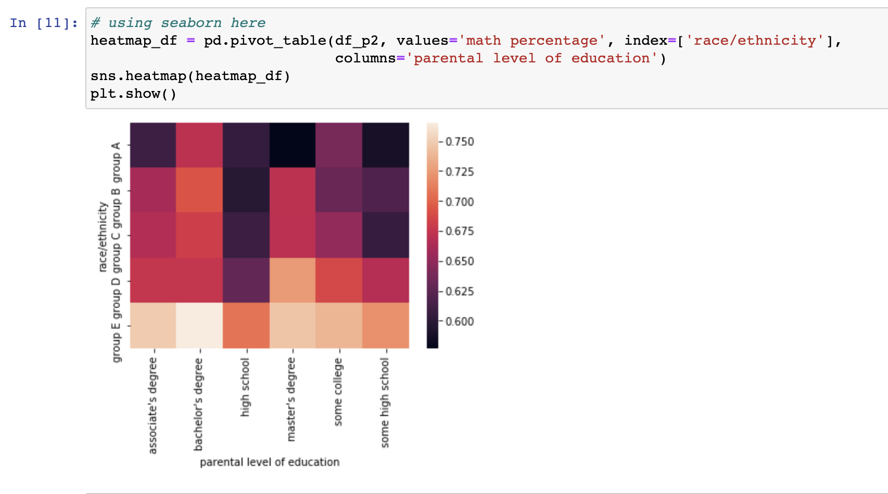
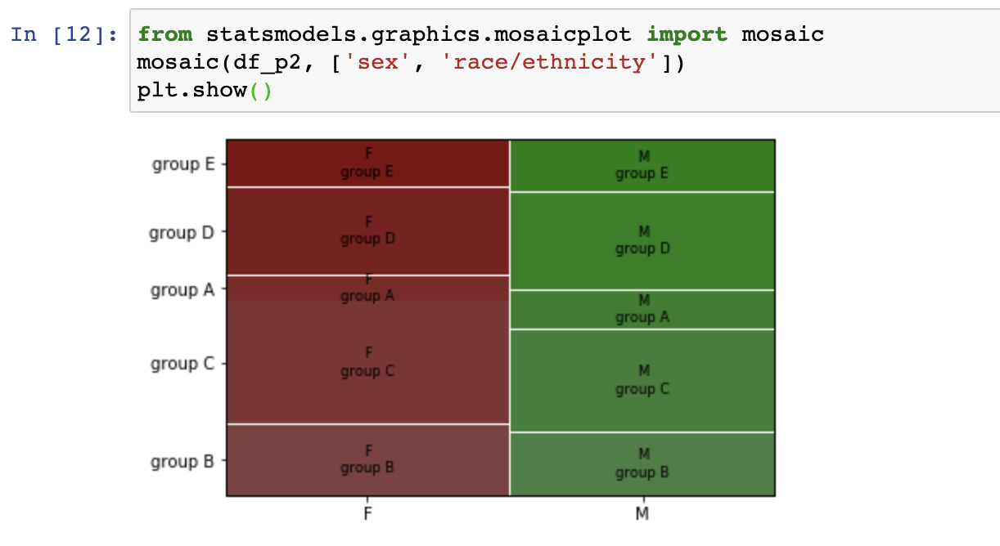

# Visualization in R v.s. Python

Zining Chen


For data scientists, R studio and Python might be two tools that are most familiar to. However, for people that are previsouly really procifient in Python (like me), it can be a little tough and unfamiliar with the grammar and functioning in R. Since R and Python are holding completely different packages for plotting, I will introduce a collection of the comman usage of the different code and syntax used for data visualization in R and Python. It also works as a cheatsheet for those that come from Python get started in R faster.


## Basic setup

The dataset is retrived from Kaggle. https://www.kaggle.com/anandhuh/covid-in-african-countries-latest-data

Generally, in R studio, the packages used for visualzation is using **ggplot**. And packages in R using `library()`. For example:


```r
library(tidyverse)
library(dplyr)
library(vcd)
df_r <- read_csv("resources/r_vs_python/covid_africa.csv")
```

In python, plotting can be done using **matplotlib**. And importing packages be like:



## Histogram

R:


```r
#original histogram
hist(df_r$`Total Deaths`, xlab = "cases", main = "Total deaths histogram")
```


```r
#basic histogram
ggplot(df_r, aes(x = `Total Deaths`)) + 
  geom_histogram(color = "white", fill = "lightblue") + 
  ggtitle("Total deaths histogram") + labs(x = "deaths")
```


Python:




## Barplot

R:


```r
#basic barplot
barplot(`Total Cases` ~ Country, data = df_r, las=2, main = "Total cases barplot")
```


```r
#ggplot barplot
ggplot(df_r, aes(x = Country, y = `Total Cases`)) +
    geom_bar(stat='identity', fill = "cornflowerblue") +
    ggtitle("Total cases barchart") +
    theme(axis.text.x = element_text(angle = 90, vjust = 0.5, hjust=1))
```


Python:





## Boxplot

R:


```r
#basic boxplot
boxplot(df_r$Population, main = "Population boxplot", xlab = "population")
```


```r
#ggplot boxplot
ggplot(df_r, aes(x = Population)) +
    geom_boxplot() +
    ggtitle("Population boxplot") 
```


Python:



## Scatterplot

R:


```r
# with a regression line
ggplot(na.omit(df_r), aes(x = `Total Tests`, y =`Population`)) +
  geom_point() +
  geom_smooth(method=lm, se=FALSE, color="blue")
```


Python:



## Parallel Coordinates

R:


```r
#choose the first 10 countries for better
GGally::ggparcoord(df_r[1:10,], columns =  c(2:5), scale = "globalminmax", groupColumn = "Country") + 
  xlab("country") + ylab("count")
```


Python:




## Heatmap

We use another dataset as an example.
The dataset is retrived from Kaggle. https://www.kaggle.com/sonukumari47/students-performance-in-exams

R:


```r
df_r2 <- read_csv("resources/r_vs_python/student_performance.csv")
df_r2 <- df_r2[,-1]
```

Python:


R:


```r
ggplot(df_r2, aes(x = `parental level of education`, y = `race/ethnicity`,fill = `math percentage`)) + 
  geom_tile() +
  scale_fill_viridis_c(direction = -1) + ggtitle("Square heatmap") +
  theme(axis.text.x = element_text(angle = 10))
```


Python:



## Mosaic Plot

R:


```r
mosaic(`race/ethnicity`~ sex , df_r2, direction = c("v", "h"))
```


Python:




